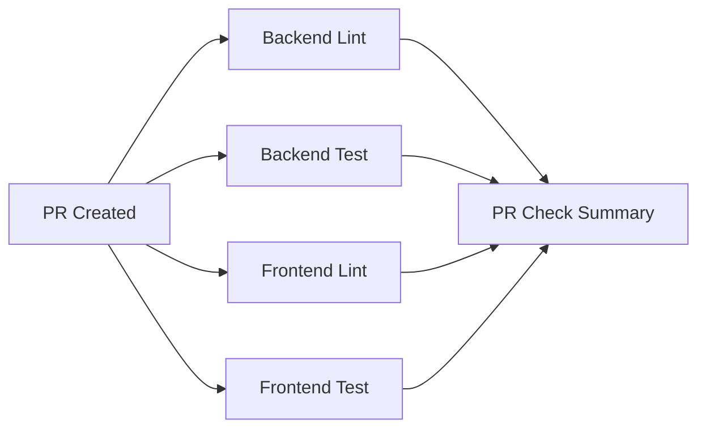
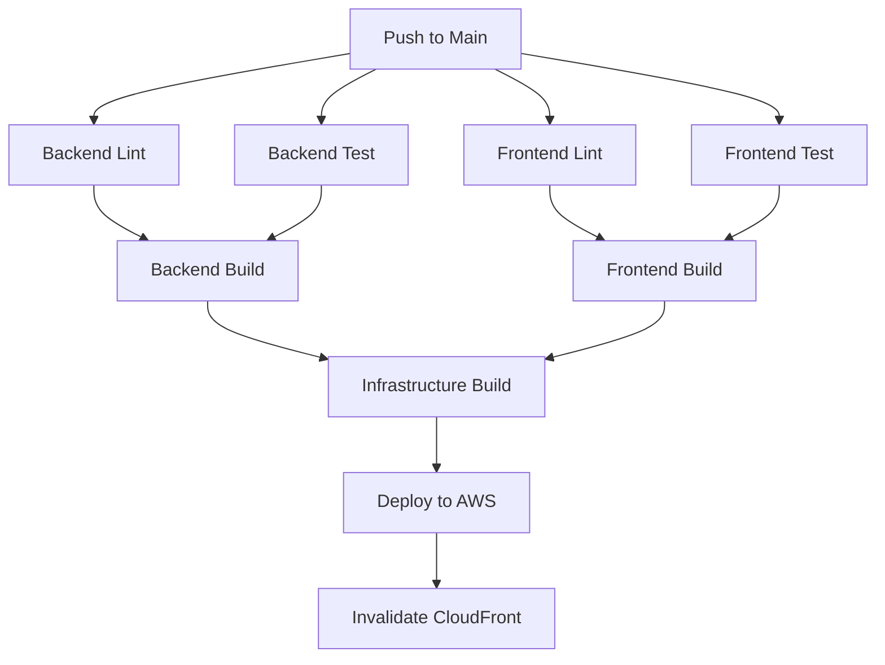

# GitHub Actions CI/CD Pipeline Setup Guide

This document provides instructions for configuring the GitHub Actions CI/CD pipeline for the Italy Trip Planner application.

## Overview

The pipeline is configured in `.github/workflows/ci-cd.yml` and includes the following jobs:

### For All Branches (on push or pull request):
- **Backend Lint**: Validates Java code style and compilation
- **Backend Test**: Runs JUnit tests for all Java modules
- **Frontend Lint**: Runs ESLint and Prettier checks
- **Frontend Test**: Runs Vitest tests with coverage

### For Main Branch Only (on push):
- **Backend Build**: Compiles Lambda functions and packages JARs
- **Frontend Build**: Builds production React app with Vite
- **Infrastructure Build**: Compiles TypeScript CDK code
- **Deploy**: Deploys to AWS using CDK

### For Pull Requests:
- Runs lint and test jobs only (no build or deploy)
- Provides summary of checks in PR

## Required GitHub Secrets

Before the pipeline can deploy to AWS, you need to configure the following secrets in your GitHub repository:

### AWS Credentials
1. Go to your GitHub repository
2. Navigate to **Settings** → **Secrets and variables** → **Actions**
3. Add the following secrets:

#### Required Secrets:
- `AWS_ACCESS_KEY_ID`: Your AWS access key ID
- `AWS_SECRET_ACCESS_KEY`: Your AWS secret access key
- `AWS_ACCOUNT_ID`: Your 12-digit AWS account ID

#### Optional Secrets:
- `VITE_API_ENDPOINT`: The API Gateway endpoint URL (optional, can be set after first deployment)

### How to Create AWS IAM User for CI/CD

1. **Create IAM User:**
   ```bash
   aws iam create-user --user-name github-actions-deploy
   ```

2. **Attach Required Policies:**
   ```bash
   aws iam attach-user-policy \
     --user-name github-actions-deploy \
     --policy-arn arn:aws:iam::aws:policy/AdministratorAccess
   ```
   
   **Note:** For production, create a custom policy with minimal required permissions:
   - CloudFormation (full access)
   - S3 (create buckets, put objects)
   - Lambda (create functions, update code)
   - API Gateway (create APIs, deploy)
   - CloudFront (create distributions, invalidate cache)
   - IAM (create roles for Lambda execution)

3. **Create Access Keys:**
   ```bash
   aws iam create-access-key --user-name github-actions-deploy
   ```
   
   Save the `AccessKeyId` and `SecretAccessKey` from the output.

4. **Add to GitHub Secrets:**
   - Copy `AccessKeyId` → GitHub Secret `AWS_ACCESS_KEY_ID`
   - Copy `SecretAccessKey` → GitHub Secret `AWS_SECRET_ACCESS_KEY`
   - Add your AWS account ID → GitHub Secret `AWS_ACCOUNT_ID`

## Pipeline Workflow

### Pull Request Flow:


### Main Branch Deployment Flow:


## Environment Variables

The pipeline uses the following environment variables:

- `NODE_VERSION`: Node.js version (default: 20)
- `JAVA_VERSION`: Java version (default: 17)
- `AWS_REGION`: AWS deployment region (default: us-east-1)

To customize these, edit the `env` section in `.github/workflows/ci-cd.yml`.

## Build Artifacts

The pipeline creates and uploads the following artifacts:

1. **lambda-artifacts**: Packaged Lambda function JARs
   - Retention: 7 days
   - Location: `lambda-functions/target/*.jar`

2. **frontend-build**: Production React build
   - Retention: 7 days
   - Location: `frontend/dist`

3. **backend-test-reports**: JUnit test reports
   - Available for debugging failed tests
   - Location: `**/target/surefire-reports/**`

4. **frontend-test-coverage**: Vitest coverage reports
   - Available for viewing test coverage
   - Location: `frontend/coverage`

## Deployment Process

When code is pushed to the `main` branch:

1. **Lint & Test**: All lint and test jobs run in parallel
2. **Build**: If tests pass, build jobs create production artifacts
3. **Infrastructure**: CDK code is compiled
4. **Deploy**: 
   - AWS credentials are configured
   - Artifacts are downloaded
   - CDK bootstrap runs (if needed)
   - CDK deploys all stacks
   - CloudFront cache is invalidated
5. **Summary**: Deployment URL and details are displayed

## Monitoring Deployments

### View Deployment Status:
1. Go to your GitHub repository
2. Click **Actions** tab
3. Click on the workflow run to see job details

### View Deployment URL:
- The CloudFront URL is displayed in the deployment job summary
- Also available as a GitHub environment URL

### Troubleshooting Failed Deployments:

#### Build Failures:
- Check the build job logs for compilation errors
- Ensure all dependencies are up to date
- Verify Maven/npm configurations

#### Test Failures:
- Download test reports artifact
- Review failed test cases
- Fix tests before merging

#### Deployment Failures:
- Verify AWS credentials are correct
- Check AWS CloudFormation console for stack errors
- Ensure IAM user has required permissions
- Review CDK deployment logs

## Manual Deployment

If you need to deploy manually (bypassing CI/CD):

```bash
# 1. Build backend
mvn clean package

# 2. Build frontend
cd frontend
npm run build
cd ..

# 3. Deploy with CDK
cd infrastructure
npm run build
npx cdk deploy --all
cd ..
```

## Customizing the Pipeline

### Add Environment-Specific Deployments:

To add staging environment:

1. **Modify the workflow** to add a staging deploy job:
   ```yaml
   deploy-staging:
     name: Deploy to Staging
     if: github.event_name == 'push' && github.ref == 'refs/heads/develop'
     # ... similar to deploy job but with staging environment
   ```

2. **Create GitHub Environment:**
   - Settings → Environments → New environment
   - Name it "staging"
   - Add environment-specific secrets

3. **Update CDK to support environments:**
   ```typescript
   const app = new cdk.App();
   const env = process.env.DEPLOY_ENV || 'production';
   new ItalyTripPlannerStack(app, `ItalyTripPlannerStack-${env}`, {
     env: { account: process.env.CDK_DEFAULT_ACCOUNT, region: 'us-east-1' }
   });
   ```

### Add Slack Notifications:

Add a notification step after deployment:

```yaml
- name: Notify Slack
  uses: slackapi/slack-github-action@v1
  with:
    webhook-url: ${{ secrets.SLACK_WEBHOOK_URL }}
    payload: |
      {
        "text": "Deployment to production complete!",
        "url": "${{ steps.get-url.outputs.cloudfront_url }}"
      }
```

## Security Best Practices

1. **Rotate AWS Credentials Regularly**: Update IAM access keys every 90 days
2. **Use Least Privilege**: Create custom IAM policy with minimal required permissions
3. **Enable Branch Protection**: Require PR reviews before merging to main
4. **Use GitHub Environments**: Add approval gates for production deployments
5. **Scan Dependencies**: Add dependency scanning jobs (Dependabot, Snyk)
6. **Store Secrets Securely**: Never commit secrets to repository

## Cost Considerations

Running this CI/CD pipeline costs:
- **GitHub Actions**: 2,000 minutes/month free for public repos
- **AWS CodeBuild**: Not used (using GitHub Actions runners)
- **AWS Data Transfer**: Minimal for deployments
- **AWS CloudFormation**: No additional cost

**Estimated monthly cost**: $0 (within free tiers)

## Support and Troubleshooting

### Common Issues:

**Issue**: "AWS credentials not configured"
- **Solution**: Verify GitHub secrets are set correctly

**Issue**: "CDK bootstrap required"
- **Solution**: Pipeline handles this automatically, but verify AWS account/region

**Issue**: "Lambda deployment fails"
- **Solution**: Check Lambda function size limits (250MB unzipped)

**Issue**: "Frontend build uses wrong API endpoint"
- **Solution**: Set `VITE_API_ENDPOINT` secret after first deployment

### Getting Help:
- Review GitHub Actions logs
- Check AWS CloudFormation console
- Review CDK deployment output
- Consult AWS documentation

## Next Steps

After setting up CI/CD:

1. ✅ Configure GitHub secrets
2. ✅ Push to main branch to trigger first deployment
3. ✅ Verify deployment in AWS console
4. ✅ Test deployed application
5. ✅ Set up monitoring and alerts
6. ✅ Configure custom domain (optional)
7. ✅ Enable HTTPS certificate (optional)
8. ✅ Set up staging environment (optional)

## References

- [GitHub Actions Documentation](https://docs.github.com/en/actions)
- [AWS CDK Documentation](https://docs.aws.amazon.com/cdk/)
- [AWS Lambda Deployment](https://docs.aws.amazon.com/lambda/latest/dg/deploying.html)
- [CloudFront Invalidation](https://docs.aws.amazon.com/AmazonCloudFront/latest/DeveloperGuide/Invalidation.html)
