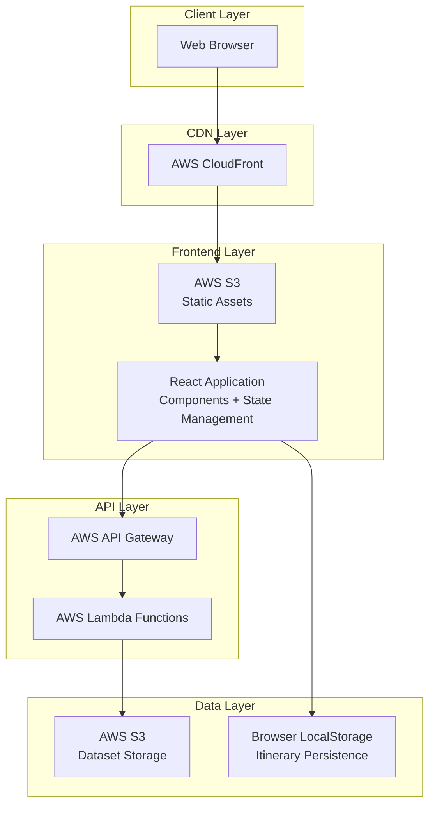
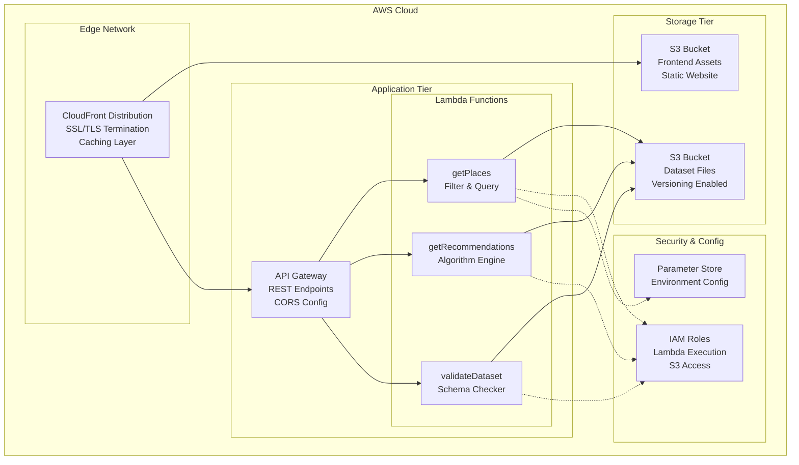
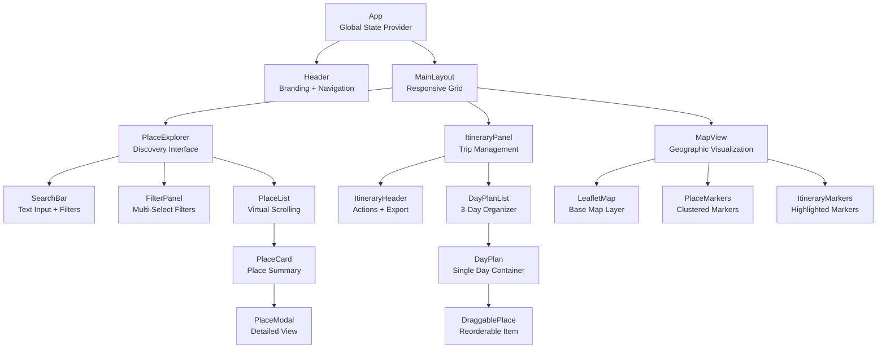
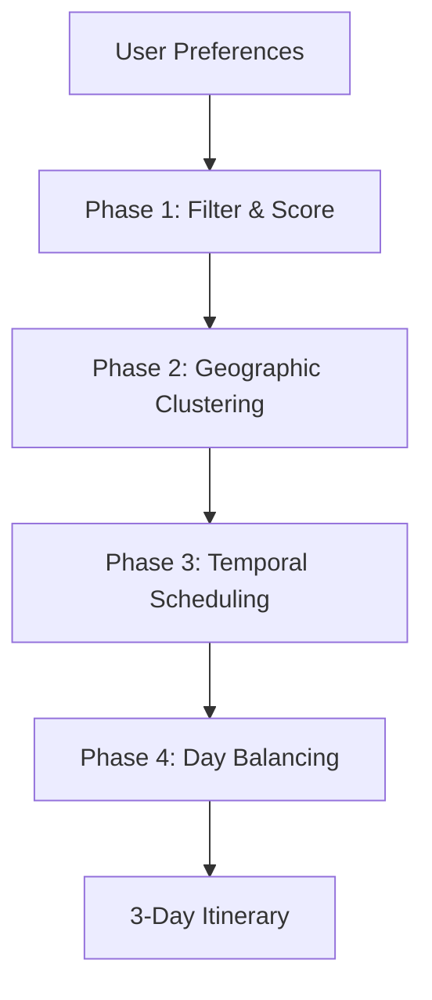

# Design Document: Italy Trip Planner

## Overview

The Italy Trip Planner is a full-stack web application that enables users to create, customize, and manage 3-day travel itineraries from curated destination datasets. The system employs a serverless AWS architecture with a React frontend, providing intelligent itinerary recommendations that users can interactively modify through drag-and-drop operations, CRUD actions, and replanning workflows.

### Core Capabilities

1. **Dataset Management**: Parse, validate, and switch between JSON datasets (default: file_italy.json, plus custom user uploads)
2. **Place Discovery**: Browse, search, and filter ~100 places with multiple attribute types
3. **Itinerary Creation**: Build 3-day plans manually or via automated recommendation engine
4. **Interactive Editing**: Drag-and-drop reordering, place substitution, and real-time validation
5. **Smart Recommendations**: Context-aware suggestions based on existing itinerary and user preferences
6. **Geographic Visualization**: Interactive map with place markers and itinerary highlights
7. **Export & Persistence**: PDF export, local storage persistence, print-friendly views
8. **Cloud Deployment**: Serverless AWS infrastructure with S3, CloudFront, Lambda, and API Gateway

### Key Design Principles

- **Clean Architecture**: Separation of concerns between presentation, business logic, and data layers
- **Resilience**: Graceful degradation when data is incomplete or unavailable
- **Performance**: Lazy loading, caching, virtual scrolling, and optimized API responses
- **Extensibility**: Plugin architecture for custom datasets and recommendation strategies
- **Accessibility**: WCAG 2.1 AA compliance with semantic HTML and keyboard navigation

---

## Architecture

### High-Level System Architecture



### Architectural Style

**Serverless JAMstack Architecture** with the following layers:

1. **Presentation Layer (React SPA)**
   - Client-side rendering with React 18+
   - State management via Context API with reducers
   - Map rendering with Leaflet.js
   - Local persistence with browser storage APIs

2. **API Layer (AWS Lambda + API Gateway)**
   - RESTful API for place data operations
   - Serverless functions for filtering, recommendations, and validation
   - Stateless request handling with idempotent operations

3. **Data Layer (AWS S3)**
   - Static dataset storage (JSON files)
   - Versioned dataset management
   - CloudFront caching for optimized delivery

### Technology Stack

**Frontend:**
- React 18+ (functional components with hooks)
- Context API + useReducer for state management
- Leaflet.js for map visualization
- React DnD for drag-and-drop editing
- Axios for HTTP requests
- jsPDF for export generation
- Tailwind CSS for styling

**Backend:**
- AWS Lambda (Node.js 20.x runtime)
- AWS API Gateway (REST API)
- AWS S3 (static hosting + data storage)
- AWS CloudFront (CDN)

**Development & Deployment:**
- AWS CDK for infrastructure as code
- GitHub Actions for CI/CD
- Jest + React Testing Library for testing
- ESLint + Prettier for code quality

### AWS Infrastructure Diagram



### Deployment Architecture

**Infrastructure Components:**

1. **CloudFront Distribution**
   - Origin: S3 static website bucket
   - SSL/TLS certificate from ACM
   - Custom domain support
   - Cache behaviors:
     - Static assets: 1 year TTL
     - index.html: No caching (ensures latest app version)
     - API calls: Forwarded to API Gateway (no caching)

2. **S3 Buckets**
   - `frontend-bucket`: React build artifacts, public read
   - `data-bucket`: JSON datasets, Lambda read access only
   - Versioning enabled for rollback capability
   - Lifecycle policies for old versions

3. **API Gateway REST API**
   - Resource paths: `/places`, `/recommendations`, `/validate`
   - CORS configuration for CloudFront origin
   - Request validation schemas
   - API key optional for rate limiting

4. **Lambda Functions**
   - Runtime: Node.js 20.x
   - Memory: 512MB (GetPlaces), 1024MB (GetRecommendations)
   - Timeout: 10 seconds
   - Environment variables from Parameter Store
   - VPC not required (public S3 access)

5. **IAM Roles**
   - Lambda execution role with S3 read permissions
   - CloudFront OAI for S3 access
   - API Gateway logging role

### Security Architecture

**Authentication & Authorization:**
- Phase 1: Public application (no authentication)
- Phase 2 (future): Cognito user pools for saved itineraries

**Data Protection:**
- HTTPS-only communication via CloudFront
- S3 bucket policies restrict direct access
- API Gateway request validation prevents injection
- Input sanitization in Lambda functions

**CORS Configuration:**
```javascript
{
  allowOrigins: ['https://yourdomain.com'],
  allowMethods: ['GET', 'POST', 'OPTIONS'],
  allowHeaders: ['Content-Type', 'X-Amz-Date', 'Authorization'],
  maxAge: 600
}
```

### Scalability & Performance

**Horizontal Scaling:**
- Lambda auto-scales to handle concurrent requests
- CloudFront edge caching reduces origin load
- S3 automatically handles request scaling

**Performance Optimizations:**
- CloudFront caching reduces latency (edge locations)
- Gzip compression for text assets
- Code splitting for React bundles
- Virtual scrolling for large place lists
- Debounced search input (300ms)
- Lazy loading for map resources

**Caching Strategy:**
- CloudFront: Static assets (31536000s), API responses not cached
- Browser: LocalStorage for itineraries, IndexedDB for datasets (future)
- Lambda: In-memory dataset caching between invocations

---

## Components and Interfaces

### Frontend Component Hierarchy



### Component Specifications

#### 1. App Component
**Responsibility:** Global state management, routing, and context provision

**State Structure:**
```typescript
interface AppState {
  dataset: {
    places: Place[];
    source: 'default' | 'custom';
    isLoading: boolean;
    error: string | null;
  };
  itinerary: {
    days: [DayPlan, DayPlan, DayPlan];
    lastModified: Date;
  };
  filters: {
    cities: string[];
    types: string[];
    tags: string[];
    priceRanges: string[];
    searchQuery: string;
  };
  ui: {
    selectedPlace: Place | null;
    activeDay: 1 | 2 | 3;
    mapCenter: [number, number];
    mapZoom: number;
  };
}
```

**Context Providers:**
- `DatasetContext`: Provides dataset and loader functions
- `ItineraryContext`: Provides itinerary state and CRUD operations
- `FilterContext`: Provides filter state and update functions
- `UIContext`: Provides UI state and modal controls

#### 2. PlaceExplorer Component
**Responsibility:** Place discovery with search and filtering

**Props:**
```typescript
interface PlaceExplorerProps {
  places: Place[];
  onPlaceSelect: (place: Place) => void;
  onAddToItinerary: (place: Place, day: number) => void;
}
```

**Key Features:**
- Debounced search input (300ms delay)
- Multi-select filter chips with AND logic
- Virtual scrolling for 100+ places
- Empty state when no results

#### 3. ItineraryPanel Component
**Responsibility:** Itinerary display and editing

**Props:**
```typescript
interface ItineraryPanelProps {
  itinerary: Itinerary;
  onReorder: (dayIndex: number, fromIndex: number, toIndex: number) => void;
  onRemove: (dayIndex: number, placeIndex: number) => void;
  onDayChange: (placeId: string, fromDay: number, toDay: number) => void;
  onExport: () => void;
  onReplan: () => void;
}
```

**Drag-and-Drop Implementation:**
- Uses react-dnd library
- DragSource: DraggablePlace component
- DropTarget: DayPlan component
- Drag preview shows place thumbnail
- Drop zones highlight on hover

**State Management:**
- Local state for drag-in-progress
- Context updates on drop completion
- Optimistic UI updates
- Undo capability (future)

#### 4. MapView Component
**Responsibility:** Geographic visualization with Leaflet

**Props:**
```typescript
interface MapViewProps {
  places: Place[];
  itineraryPlaces: Place[];
  center: [number, number];
  zoom: number;
  onMarkerClick: (place: Place) => void;
}
```

**Map Configuration:**
- Base layer: OpenStreetMap tiles
- Marker clustering for dense areas
- Custom icons for different place types
- Highlighted markers for itinerary places
- Popup on marker click

**Performance Considerations:**
- Lazy load Leaflet library (React.lazy)
- Debounce map move events
- Cluster markers when zoom < 10
- Limit visible markers to viewport

#### 5. PlaceCard Component
**Responsibility:** Place summary display

**Props:**
```typescript
interface PlaceCardProps {
  place: Place;
  isInItinerary: boolean;
  onSelect: () => void;
  onAddToItinerary: () => void;
}
```

**Display Logic:**
- Show rating as stars (★★★★☆)
- Show price range as euro symbols (€€)
- Show tags as colored badges
- Show booking required indicator
- Fallback for missing fields

#### 6. DayPlan Component
**Responsibility:** Single day container with drop target

**Props:**
```typescript
interface DayPlanProps {
  day: number;
  places: Place[];
  totalDuration: number;
  onDrop: (place: Place) => void;
  onReorder: (fromIndex: number, toIndex: number) => void;
}
```

**Features:**
- Time calculation display (8:00 AM start time)
- Warning indicator when > 10 hours
- Empty state with add place prompt
- Day header with summary stats

### State Management Strategy

**Context API + useReducer Pattern:**

```typescript
// Itinerary Reducer
type ItineraryAction =
  | { type: 'ADD_PLACE'; payload: { place: Place; day: number } }
  | { type: 'REMOVE_PLACE'; payload: { day: number; index: number } }
  | { type: 'REORDER_PLACES'; payload: { day: number; fromIndex: number; toIndex: number } }
  | { type: 'MOVE_PLACE'; payload: { fromDay: number; toDay: number; placeId: string } }
  | { type: 'REPLACE_ITINERARY'; payload: { itinerary: Itinerary } }
  | { type: 'CLEAR_ITINERARY' };

function itineraryReducer(state: ItineraryState, action: ItineraryAction): ItineraryState {
  switch (action.type) {
    case 'ADD_PLACE': {
      const { place, day } = action.payload;
      const newDays = [...state.days];
      newDays[day - 1] = {
        ...newDays[day - 1],
        places: [...newDays[day - 1].places, place]
      };
      return { ...state, days: newDays, lastModified: new Date() };
    }
    // ... other cases
  }
}
```

**Persistence Layer:**
```typescript
// Save to LocalStorage on state changes
useEffect(() => {
  localStorage.setItem('itinerary', JSON.stringify(itineraryState));
}, [itineraryState]);

// Restore on mount
useEffect(() => {
  const saved = localStorage.getItem('itinerary');
  if (saved) {
    dispatch({ type: 'REPLACE_ITINERARY', payload: JSON.parse(saved) });
  }
}, []);
```

**Why Context API over Redux:**
- Simpler setup for medium complexity
- Built-in React solution (no dependencies)
- Sufficient for app-wide state
- Easy to test with React Testing Library
- Can migrate to Redux if complexity grows

### API Client Interface

**HTTP Client Wrapper:**
```typescript
class PlacesAPIClient {
  private baseURL: string;
  private axios: AxiosInstance;

  constructor(baseURL: string) {
    this.baseURL = baseURL;
    this.axios = axios.create({
      baseURL,
      timeout: 10000,
      headers: { 'Content-Type': 'application/json' }
    });
  }

  async getPlaces(filters?: PlaceFilters): Promise<Place[]> {
    const params = new URLSearchParams();
    if (filters?.cities) params.append('cities', filters.cities.join(','));
    if (filters?.types) params.append('types', filters.types.join(','));
    if (filters?.tags) params.append('tags', filters.tags.join(','));
    
    const response = await this.axios.get<Place[]>('/places', { params });
    return response.data;
  }

  async getRecommendations(preferences: UserPreferences): Promise<Itinerary> {
    const response = await this.axios.post<Itinerary>('/recommendations', preferences);
    return response.data;
  }

  async validateDataset(file: File): Promise<ValidationResult> {
    const formData = new FormData();
    formData.append('dataset', file);
    const response = await this.axios.post<ValidationResult>('/validate', formData);
    return response.data;
  }
}
```

---

## Data Models

### Place Model

```typescript
interface Place {
  // Required fields
  id: string;                    // Unique identifier (e.g., "place_001")
  name: string;                  // Display name
  type: PlaceType;               // Category classification
  city: string;                  // Primary city location
  latitude: number;              // Decimal degrees
  longitude: number;             // Decimal degrees

  // Optional fields (may be null/undefined)
  region?: string | null;        // Geographic region
  neighborhood?: string | null;  // Local neighborhood
  description?: string | null;   // Rich text description
  hours?: string | null;         // Operating hours (free text)
  duration_minutes?: number | null; // Estimated visit duration
  price_range?: string | null;   // Cost indicator (€, €€, €€€, €€€€)
  rating?: number | null;        // User rating (1.0-5.0)
  tags?: string[];               // Categorization tags
  seasonal_notes?: string | null; // Seasonal information
  booking_required?: boolean | null; // Advance booking indicator
}

type PlaceType =
  | 'restaurant'
  | 'historic_site'
  | 'museum'
  | 'neighborhood'
  | 'market'
  | 'cafe'
  | 'viewpoint'
  | 'experience'
  | 'park';
```

**Validation Rules:**
- `id`: Must be unique across dataset, match pattern `place_\d{3}`
- `name`: Non-empty string, max 200 characters
- `type`: Must be one of the enumerated PlaceType values
- `city`: Non-empty string, max 100 characters
- `latitude`: Range -90 to 90
- `longitude`: Range -180 to 180
- `rating`: If present, range 0.0 to 5.0
- `duration_minutes`: If present, range 1 to 1440 (24 hours)

### Itinerary Model

```typescript
interface Itinerary {
  id: string;                    // UUID for persistence
  name: string;                  // User-defined name
  days: [DayPlan, DayPlan, DayPlan]; // Fixed 3-day structure
  preferences: UserPreferences;  // Generation parameters
  createdAt: Date;
  lastModified: Date;
}

interface DayPlan {
  dayNumber: 1 | 2 | 3;
  places: Place[];               // Ordered list
  totalDuration: number;         // Sum of duration_minutes
  startTime: string;             // Default "08:00"
}
```

**Invariants:**
- Itinerary must always have exactly 3 days
- Places can appear in multiple days (for multi-day destinations)
- Empty days are valid (no minimum place count)
- Place order within a day is significant

### User Preferences Model

```typescript
interface UserPreferences {
  cities: string[];              // Preferred cities (max 3)
  interests: string[];           // Preferred tags (max 5)
  pace: 'relaxed' | 'moderate' | 'packed'; // Activity level
  priceRange: string[];          // Budget constraints (€, €€, etc.)
  includeBookingRequired: boolean; // Filter for advance booking
}
```

### Filter State Model

```typescript
interface FilterState {
  cities: string[];              // AND logic within, OR across categories
  types: PlaceType[];
  tags: string[];
  priceRanges: string[];
  searchQuery: string;           // Case-insensitive substring match
  hasCoordinates?: boolean;      // Filter for map-ready places
}
```

### Validation Result Model

```typescript
interface ValidationResult {
  isValid: boolean;
  errors: ValidationError[];
  warnings: ValidationWarning[];
  placeCount: number;
  excludedCount: number;
}

interface ValidationError {
  placeId: string | null;        // Null for file-level errors
  field: string;
  message: string;
  severity: 'critical' | 'non-critical';
}

interface ValidationWarning {
  placeId: string;
  field: string;
  message: string;
  impact: string;                // Description of feature impact
}
```

### API Request/Response Models

**GET /places**

Query Parameters:
```typescript
interface GetPlacesQuery {
  cities?: string;               // Comma-separated
  types?: string;                // Comma-separated
  tags?: string;                 // Comma-separated
  limit?: number;                // Default 100
  offset?: number;               // Pagination offset
}
```

Response:
```typescript
interface GetPlacesResponse {
  places: Place[];
  total: number;
  hasMore: boolean;
}
```

**POST /recommendations**

Request Body:
```typescript
interface RecommendationsRequest {
  preferences: UserPreferences;
  existingItinerary?: Itinerary; // For replan functionality
}
```

Response:
```typescript
interface RecommendationsResponse {
  itinerary: Itinerary;
  reasoning: string;             // Human-readable explanation
  alternativePlaces: Place[];    // Runner-up suggestions
}
```

**POST /validate**

Request: Multipart form data with `dataset` file field

Response: `ValidationResult` (see above)

---

## Algorithm Design: Recommendation Engine

### Overview

The recommendation engine generates 3-day itineraries by scoring places against user preferences and optimizing for temporal feasibility, geographic clustering, and diversity. The algorithm balances multiple competing objectives: user satisfaction, logistical efficiency, and activity variety.

### Algorithm Phases



### Phase 1: Scoring Function

Each place receives a score based on preference alignment:

```typescript
function scorePlaceForPreferences(place: Place, preferences: UserPreferences): number {
  let score = 0;
  
  // City match (weight: 3)
  if (preferences.cities.includes(place.city)) {
    score += 3;
  }
  
  // Interest/tag match (weight: 2 per match)
  const matchingTags = place.tags?.filter(tag => preferences.interests.includes(tag)) || [];
  score += matchingTags.length * 2;
  
  // Price range match (weight: 1)
  if (preferences.priceRange.includes(place.price_range || '€')) {
    score += 1;
  }
  
  // Rating boost (weight: rating / 2)
  if (place.rating) {
    score += place.rating / 2;
  }
  
  // Booking required penalty if user preference is false (weight: -2)
  if (!preferences.includeBookingRequired && place.booking_required) {
    score -= 2;
  }
  
  return Math.max(0, score); // Floor at 0
}
```

**Filtering:**
- Exclude places with score < 1 (no preference match)
- Exclude places with missing critical fields
- If < 15 places pass, relax city constraint

### Phase 2: Geographic Clustering

Group places by city to minimize inter-city travel within days:

```typescript
function clusterByCity(places: Place[]): Map<string, Place[]> {
  const clusters = new Map<string, Place[]>();
  
  for (const place of places) {
    const cityPlaces = clusters.get(place.city) || [];
    cityPlaces.push(place);
    clusters.set(place.city, cityPlaces);
  }
  
  // Sort clusters by total score
  return new Map(
    Array.from(clusters.entries()).sort((a, b) => {
      const scoreA = a[1].reduce((sum, p) => sum + p._score, 0);
      const scoreB = b[1].reduce((sum, p) => sum + p._score, 0);
      return scoreB - scoreA;
    })
  );
}
```

**Allocation Strategy:**
- Assign top 1-2 cities to dedicated days
- If 3+ cities, distribute across days
- Aim for <= 2 cities per day

### Phase 3: Temporal Scheduling

Assign places to time slots within each day:

```typescript
function schedulePlaces(places: Place[], pace: UserPreferences['pace']): Place[] {
  const maxDailyMinutes = {
    relaxed: 360,   // 6 hours
    moderate: 480,  // 8 hours
    packed: 600     // 10 hours
  }[pace];
  
  const scheduled: Place[] = [];
  let currentMinutes = 0;
  
  // Sort by priority: morning tags first, then by score
  const sorted = places.sort((a, b) => {
    const aMorning = a.tags?.includes('morning') ? 1 : 0;
    const bMorning = b.tags?.includes('morning') ? 1 : 0;
    if (aMorning !== bMorning) return bMorning - aMorning;
    return (b._score || 0) - (a._score || 0);
  });
  
  for (const place of sorted) {
    const duration = place.duration_minutes || 60;
    if (currentMinutes + duration <= maxDailyMinutes) {
      scheduled.push(place);
      currentMinutes += duration;
    }
  }
  
  return scheduled;
}
```

**Time Constraints:**
- Default start time: 8:00 AM
- Respect `hours` field as hint (not strict constraint in v1)
- Add 30-minute buffer between places for travel
- Prioritize morning-tagged places early

### Phase 4: Day Balancing

Ensure diversity and balance across 3 days:

```typescript
function balanceItinerary(dayPlans: DayPlan[]): DayPlan[] {
  // Goal: Each day has 3-5 places, mix of types
  for (let i = 0; i < dayPlans.length; i++) {
    const day = dayPlans[i];
    
    // Ensure type diversity: no more than 2 of same type
    const typeCounts = new Map<PlaceType, number>();
    day.places.forEach(p => {
      typeCounts.set(p.type, (typeCounts.get(p.type) || 0) + 1);
    });
    
    // Remove excess same-type places (keep highest scored)
    for (const [type, count] of typeCounts) {
      if (count > 2) {
        const samePlaces = day.places.filter(p => p.type === type).sort((a, b) => (b._score || 0) - (a._score || 0));
        const toRemove = samePlaces.slice(2);
        day.places = day.places.filter(p => !toRemove.includes(p));
      }
    }
    
    // Ensure meal coverage: at least 1 restaurant/cafe per day
    const hasMeal = day.places.some(p => p.type === 'restaurant' || p.type === 'cafe');
    if (!hasMeal && i < dayPlans.length - 1) {
      // Move a restaurant from next day or add from pool
    }
  }
  
  return dayPlans;
}
```

**Balancing Rules:**
- Maximum 2 places of same type per day
- Minimum 1 meal place per day
- Distribute high-rated places across days
- Ensure geographic coherence (don't zigzag cities)

### Replan Strategy

When user triggers replan with updated preferences:

1. **Preserve User Edits:** Identify places manually added/removed
2. **Rescore All Places:** Apply new scoring function
3. **Regenerate:** Run full algorithm with new scores
4. **Merge:** Retain manually added places if they still fit constraints
5. **Present:** Show new itinerary with change summary

### Performance Considerations

- **Time Complexity:** O(n log n) where n = place count (~100)
- **Caching:** Cache scored places for 5 minutes (same preferences)
- **Async Execution:** Run in Lambda with 5-second timeout
- **Fallback:** If algorithm fails, return top-scored places in simple list

---

## Smart Data Validation: Criticality Assessment

### Validation Philosophy

Not all missing data is equally problematic. The validation system classifies fields by **criticality** — how severely their absence impacts core functionality — and makes intelligent decisions about inclusion vs. exclusion.

### Field Criticality Classification

```typescript
enum FieldCriticality {
  CRITICAL_ALWAYS = 'critical_always',      // Always required
  CRITICAL_CONDITIONAL = 'critical_conditional', // Required for specific features
  IMPORTANT = 'important',                   // Degrades UX but not blocking
  OPTIONAL = 'optional'                      // Nice to have
}

const FIELD_CRITICALITY_MAP: Record<keyof Place, FieldCriticality> = {
  id: FieldCriticality.CRITICAL_ALWAYS,
  name: FieldCriticality.CRITICAL_ALWAYS,
  type: FieldCriticality.CRITICAL_ALWAYS,
  city: FieldCriticality.CRITICAL_ALWAYS,
  latitude: FieldCriticality.CRITICAL_CONDITIONAL,  // For map only
  longitude: FieldCriticality.CRITICAL_CONDITIONAL, // For map only
  description: FieldCriticality.IMPORTANT,
  hours: FieldCriticality.IMPORTANT,
  duration_minutes: FieldCriticality.IMPORTANT,
  rating: FieldCriticality.IMPORTANT,
  price_range: FieldCriticality.IMPORTANT,
  region: FieldCriticality.OPTIONAL,
  neighborhood: FieldCriticality.OPTIONAL,
  tags: FieldCriticality.OPTIONAL,
  seasonal_notes: FieldCriticality.OPTIONAL,
  booking_required: FieldCriticality.OPTIONAL
};
```

### Validation Logic

```typescript
interface ValidationContext {
  enabledFeatures: Set<string>; // e.g., ['map', 'recommendations', 'export']
}

function validatePlace(place: Partial<Place>, context: ValidationContext): ValidationOutcome {
  const errors: ValidationError[] = [];
  const warnings: ValidationWarning[] = [];
  
  // Always-critical fields
  if (!place.id) errors.push({ field: 'id', severity: 'critical', message: 'Missing unique identifier' });
  if (!place.name) errors.push({ field: 'name', severity: 'critical', message: 'Missing display name' });
  if (!place.type) errors.push({ field: 'type', severity: 'critical', message: 'Missing place type' });
  if (!place.city) errors.push({ field: 'city', severity: 'critical', message: 'Missing city' });
  
  // Conditionally-critical fields
  if (context.enabledFeatures.has('map')) {
    if (place.latitude == null) {
      warnings.push({
        field: 'latitude',
        message: 'Missing latitude coordinate',
        impact: 'Place will not appear on map but remains in lists'
      });
    }
    if (place.longitude == null) {
      warnings.push({
        field: 'longitude',
        message: 'Missing longitude coordinate',
        impact: 'Place will not appear on map but remains in lists'
      });
    }
  }
  
  // Important fields (warnings only)
  if (!place.description) {
    warnings.push({
      field: 'description',
      message: 'Missing description',
      impact: 'Reduced information in place details view'
    });
  }
  
  if (place.duration_minutes == null) {
    warnings.push({
      field: 'duration_minutes',
      message: 'Missing duration',
      impact: 'Will use default 60-minute estimate for scheduling'
    });
  }
  
  // Determine inclusion
  const shouldInclude = errors.length === 0; // Only exclude if critical errors
  
  return {
    isValid: shouldInclude,
    errors,
    warnings,
    place: shouldInclude ? fillDefaults(place) : null
  };
}
```

### Default Value Strategy

For important missing fields, apply sensible defaults:

```typescript
function fillDefaults(place: Partial<Place>): Place {
  return {
    ...place,
    duration_minutes: place.duration_minutes ?? 60,
    rating: place.rating ?? null,  // Show as "Unrated"
    price_range: place.price_range ?? '€',
    tags: place.tags ?? [],
    description: place.description ?? 'No description available.',
    hours: place.hours ?? 'Hours not specified',
    booking_required: place.booking_required ?? false
  } as Place;
}
```

### Feature-Specific Filtering

Different features apply different filters:

```typescript
// Map component: Only show places with coordinates
const mapPlaces = allPlaces.filter(p => p.latitude != null && p.longitude != null);

// List view: Show all valid places
const listPlaces = allPlaces;

// Recommendation engine: Prefer places with complete data
const scoredPlaces = allPlaces.map(p => ({
  ...p,
  _score: calculateScore(p) * (hasCompleteData(p) ? 1.0 : 0.8)  // 20% penalty for incomplete
}));
```

### User-Facing Messaging

When validation results in exclusions or warnings:

```typescript
interface ValidationSummary {
  totalPlaces: number;
  includedPlaces: number;
  excludedPlaces: number;
  warnings: number;
  message: string;
}

function buildSummary(results: ValidationOutcome[]): ValidationSummary {
  const included = results.filter(r => r.isValid).length;
  const excluded = results.filter(r => !r.isValid).length;
  const totalWarnings = results.reduce((sum, r) => sum + r.warnings.length, 0);
  
  const message = excluded > 0
    ? `Loaded ${included} of ${results.length} places. ${excluded} places excluded due to missing required fields (id, name, type, city). ${totalWarnings} warnings for places with incomplete optional data.`
    : `Loaded ${included} places successfully. ${totalWarnings} warnings for places with incomplete optional data.`;
  
  return {
    totalPlaces: results.length,
    includedPlaces: included,
    excludedPlaces: excluded,
    warnings: totalWarnings,
    message
  };
}
```

---

## Error Handling

### Error Classification

```typescript
enum ErrorType {
  NETWORK_ERROR = 'network_error',           // API unreachable
  VALIDATION_ERROR = 'validation_error',     // Invalid data format
  NOT_FOUND_ERROR = 'not_found_error',       // Resource missing
  RATE_LIMIT_ERROR = 'rate_limit_error',     // Too many requests
  INTERNAL_ERROR = 'internal_error',         // Server fault
  CLIENT_ERROR = 'client_error'              // Invalid request
}

interface AppError {
  type: ErrorType;
  message: string;
  userMessage: string;
  details?: any;
  retryable: boolean;
  timestamp: Date;
}
```

### Frontend Error Handling

**API Call Wrapper:**
```typescript
async function safeAPICall<T>(
  apiCall: () => Promise<T>,
  errorContext: string
): Promise<T | null> {
  try {
    return await apiCall();
  } catch (error) {
    if (axios.isAxiosError(error)) {
      const appError: AppError = {
        type: classifyAxiosError(error),
        message: error.message,
        userMessage: getUserFriendlyMessage(error, errorContext),
        details: error.response?.data,
        retryable: error.response?.status !== 400,
        timestamp: new Date()
      };
      
      // Log to monitoring service
      logError(appError);
      
      // Show user notification
      showErrorToast(appError.userMessage);
      
      return null;
    }
    
    throw error; // Re-throw unexpected errors
  }
}
```

**Error Boundary Component:**
```typescript
class AppErrorBoundary extends React.Component<Props, State> {
  componentDidCatch(error: Error, errorInfo: React.ErrorInfo) {
    logError({
      type: ErrorType.INTERNAL_ERROR,
      message: error.message,
      userMessage: 'Something went wrong. Please refresh the page.',
      details: errorInfo,
      retryable: true,
      timestamp: new Date()
    });
  }

  render() {
    if (this.state.hasError) {
      return (
        <ErrorFallback
          message="The application encountered an error"
          onReset={() => window.location.reload()}
        />
      );
    }
    return this.props.children;
  }
}
```

### Backend Error Handling

**Lambda Function Template:**
```typescript
export async function handler(event: APIGatewayProxyEvent): Promise<APIGatewayProxyResult> {
  try {
    // Input validation
    if (!event.body) {
      return {
        statusCode: 400,
        body: JSON.stringify({
          error: 'Missing request body',
          type: ErrorType.CLIENT_ERROR
        })
      };
    }
    
    // Business logic
    const result = await processRequest(event);
    
    return {
      statusCode: 200,
      headers: { 'Content-Type': 'application/json' },
      body: JSON.stringify(result)
    };
    
  } catch (error) {
    console.error('Lambda error:', error);
    
    if (error instanceof ValidationError) {
      return {
        statusCode: 400,
        body: JSON.stringify({
          error: error.message,
          type: ErrorType.VALIDATION_ERROR,
          details: error.details
        })
      };
    }
    
    // Generic error response
    return {
      statusCode: 500,
      body: JSON.stringify({
        error: 'Internal server error',
        type: ErrorType.INTERNAL_ERROR
      })
    };
  }
}
```

### Graceful Degradation Strategies

**Feature Fallbacks:**

1. **Map Unavailable:**
   - Show list view only
   - Display message: "Map temporarily unavailable"
   - Provide retry button

2. **API Timeout:**
   - Use cached dataset (if available)
   - Show stale data indicator
   - Background retry with exponential backoff

3. **Invalid Dataset:**
   - Fall back to default file_italy.json
   - Show validation error summary
   - Allow user to fix and re-upload

4. **LocalStorage Full:**
   - Offer export as JSON download
   - Clear old itineraries
   - Reduce cached data

### User-Facing Error Messages

**Mapping Technical Errors to User Messages:**

```typescript
function getUserFriendlyMessage(error: AxiosError, context: string): string {
  const statusCode = error.response?.status;
  
  if (statusCode === 400) {
    return `Invalid ${context}. Please check your input and try again.`;
  }
  
  if (statusCode === 404) {
    return `The requested ${context} was not found.`;
  }
  
  if (statusCode === 429) {
    return 'Too many requests. Please wait a moment and try again.';
  }
  
  if (statusCode && statusCode >= 500) {
    return 'Our servers are experiencing issues. Please try again in a few minutes.';
  }
  
  if (error.code === 'ECONNABORTED') {
    return 'The request took too long. Please check your connection and try again.';
  }
  
  if (error.code === 'ERR_NETWORK') {
    return 'Unable to connect. Please check your internet connection.';
  }
  
  return `An error occurred while ${context}. Please try again.`;
}
```

---

## Testing Strategy

### Testing Philosophy

The application requires a dual testing approach combining **example-based unit tests** for specific scenarios and edge cases with **integration tests** for end-to-end workflows. Property-based testing is **not applicable** for this application as it involves:
- UI rendering and interaction
- External API integration
- Infrastructure configuration (AWS services)
- Side-effect-heavy operations (state management, storage)

These characteristics make example-based and integration testing more appropriate than universal property verification.

### Test Coverage Goals

- **Unit Tests:** 80% code coverage for business logic
- **Integration Tests:** Cover critical user workflows
- **E2E Tests:** Smoke tests for deployment verification
- **Manual Tests:** Accessibility and UX validation

### Unit Testing Strategy

**Framework:** Jest + React Testing Library

**Component Testing:**
```typescript
describe('PlaceCard', () => {
  it('displays place information correctly', () => {
    const place: Place = {
      id: 'place_001',
      name: 'Colosseum',
      type: 'historic_site',
      city: 'Rome',
      rating: 4.8,
      price_range: '€€',
      tags: ['iconic', 'historic'],
      latitude: 41.8902,
      longitude: 12.4922
    };
    
    render(<PlaceCard place={place} />);
    
    expect(screen.getByText('Colosseum')).toBeInTheDocument();
    expect(screen.getByText('Rome')).toBeInTheDocument();
    expect(screen.getByText('€€')).toBeInTheDocument();
    expect(screen.getByText('★★★★★')).toBeInTheDocument();
  });
  
  it('handles missing optional fields gracefully', () => {
    const place: Place = {
      id: 'place_002',
      name: 'Local Spot',
      type: 'cafe',
      city: 'Florence',
      latitude: 43.7696,
      longitude: 11.2558,
      description: null,
      rating: null,
      price_range: null
    };
    
    render(<PlaceCard place={place} />);
    
    expect(screen.getByText('Local Spot')).toBeInTheDocument();
    expect(screen.getByText('Unrated')).toBeInTheDocument();
  });
});
```

**Recommendation Engine Testing:**
```typescript
describe('Recommendation Engine', () => {
  it('scores places correctly based on preferences', () => {
    const place: Place = {
      id: 'place_001',
      name: 'Uffizi Gallery',
      type: 'museum',
      city: 'Florence',
      tags: ['art', 'cultural', 'iconic'],
      rating: 4.8,
      price_range: '€€',
      latitude: 43.7687,
      longitude: 11.2558
    };
    
    const preferences: UserPreferences = {
      cities: ['Florence'],
      interests: ['art', 'cultural'],
      pace: 'moderate',
      priceRange: ['€€'],
      includeBookingRequired: true
    };
    
    const score = scorePlaceForPreferences(place, preferences);
    
    // City match (3) + 2 tag matches (4) + price match (1) + rating boost (2.4) = 10.4
    expect(score).toBeCloseTo(10.4, 1);
  });
  
  it('generates balanced 3-day itinerary', () => {
    const places = generateTestPlaces(50);
    const preferences: UserPreferences = {
      cities: ['Rome', 'Florence'],
      interests: ['food', 'historic'],
      pace: 'moderate',
      priceRange: ['€', '€€'],
      includeBookingRequired: true
    };
    
    const itinerary = generateItinerary(places, preferences);
    
    expect(itinerary.days).toHaveLength(3);
    itinerary.days.forEach(day => {
      expect(day.places.length).toBeGreaterThan(0);
      expect(day.totalDuration).toBeLessThanOrEqual(480); // 8 hours for moderate pace
    });
  });
  
  it('avoids same-city zigzagging within days', () => {
    const places = [
      { id: '1', city: 'Rome', ...basePlace },
      { id: '2', city: 'Florence', ...basePlace },
      { id: '3', city: 'Rome', ...basePlace },
      { id: '4', city: 'Florence', ...basePlace }
    ];
    
    const itinerary = generateItinerary(places, defaultPreferences);
    
    itinerary.days.forEach(day => {
      const cities = day.places.map(p => p.city);
      const uniqueCities = new Set(cities);
      // Each day should have <= 2 cities and shouldn't jump Rome -> Florence -> Rome
      expect(uniqueCities.size).toBeLessThanOrEqual(2);
    });
  });
});
```

**Validation Logic Testing:**
```typescript
describe('Data Validation', () => {
  it('accepts place with all required fields', () => {
    const place: Partial<Place> = {
      id: 'place_001',
      name: 'Test Place',
      type: 'restaurant',
      city: 'Rome',
      latitude: 41.8902,
      longitude: 12.4922
    };
    
    const result = validatePlace(place, { enabledFeatures: new Set(['map']) });
    
    expect(result.isValid).toBe(true);
    expect(result.errors).toHaveLength(0);
  });
  
  it('rejects place missing critical fields', () => {
    const place: Partial<Place> = {
      name: 'Test Place',
      type: 'restaurant'
      // Missing id and city
    };
    
    const result = validatePlace(place, { enabledFeatures: new Set() });
    
    expect(result.isValid).toBe(false);
    expect(result.errors).toContainEqual(
      expect.objectContaining({ field: 'id', severity: 'critical' })
    );
    expect(result.errors).toContainEqual(
      expect.objectContaining({ field: 'city', severity: 'critical' })
    );
  });
  
  it('includes place with missing coordinates but warns for map feature', () => {
    const place: Partial<Place> = {
      id: 'place_001',
      name: 'Test Place',
      type: 'restaurant',
      city: 'Rome'
      // Missing latitude and longitude
    };
    
    const result = validatePlace(place, { enabledFeatures: new Set(['map']) });
    
    expect(result.isValid).toBe(true);
    expect(result.warnings).toContainEqual(
      expect.objectContaining({
        field: 'latitude',
        impact: expect.stringContaining('not appear on map')
      })
    );
  });
});
```

### Integration Testing

**Framework:** Cypress or Playwright

**Critical User Workflows:**

1. **Browse and Filter Places:**
   - Load application
   - Verify places display in list
   - Apply city filter
   - Verify filtered results
   - Apply tag filter
   - Verify combined filter results
   - Clear filters
   - Verify all places return

2. **Create Manual Itinerary:**
   - Add place to Day 1
   - Verify place appears in itinerary
   - Add place to Day 2
   - Drag place from Day 1 to Day 3
   - Verify place moved
   - Remove place from Day 2
   - Verify place removed
   - Export itinerary
   - Verify PDF downloads

3. **Generate Recommended Itinerary:**
   - Click "Generate Recommendation"
   - Enter preferences (cities, interests, pace)
   - Submit preferences
   - Verify 3-day itinerary generated
   - Verify places match preferences
   - Edit generated itinerary
   - Verify edits persist

4. **Upload Custom Dataset:**
   - Click "Upload Custom Dataset"
   - Select valid JSON file
   - Verify success message
   - Verify places from new dataset display
   - Switch back to default dataset
   - Verify Italy places display

5. **Map Visualization:**
   - Load application
   - Verify map displays with markers
   - Click place marker
   - Verify popup with place details
   - Add place to itinerary
   - Verify marker style changes
   - Zoom map
   - Verify marker clustering

### Performance Testing

**Metrics to Monitor:**
- Initial page load time: < 3 seconds
- Time to interactive (TTI): < 5 seconds
- API response time: < 500ms (p95)
- Place list rendering: < 100ms for 100 items
- Map marker rendering: < 200ms for 100 markers

**Load Testing:**
- Simulate 100 concurrent users
- Verify Lambda auto-scaling
- Verify CloudFront cache hit rate > 80%
- Monitor API Gateway throttling

### Accessibility Testing

**Manual Testing Checklist:**
- [ ] Keyboard navigation works for all interactive elements
- [ ] Screen reader announces page sections and state changes
- [ ] Color contrast ratios meet WCAG AA (4.5:1 for text)
- [ ] Focus indicators are visible
- [ ] Forms have accessible labels
- [ ] Images have alt text
- [ ] Skip links allow bypassing navigation

**Automated Testing:**
- Use axe-core for automated a11y checks
- Run Lighthouse audits for accessibility score > 90
- Test with NVDA/JAWS screen readers

### Test Data Management

**Mock Dataset:**
```typescript
export const mockPlaces: Place[] = [
  {
    id: 'place_001',
    name: 'Test Museum',
    type: 'museum',
    city: 'Rome',
    latitude: 41.9028,
    longitude: 12.4964,
    rating: 4.5,
    price_range: '€€',
    tags: ['art', 'cultural'],
    duration_minutes: 120
  },
  // ... more test places
];

export const mockItinerary: Itinerary = {
  id: 'test-itinerary-1',
  name: 'Test Rome Trip',
  days: [
    { dayNumber: 1, places: [mockPlaces[0], mockPlaces[1]], totalDuration: 240, startTime: '08:00' },
    { dayNumber: 2, places: [mockPlaces[2]], totalDuration: 90, startTime: '08:00' },
    { dayNumber: 3, places: [], totalDuration: 0, startTime: '08:00' }
  ],
  preferences: mockPreferences,
  createdAt: new Date('2024-01-01'),
  lastModified: new Date('2024-01-01')
};
```

**API Mocking:**
```typescript
// Mock Service Worker (MSW) handlers
export const handlers = [
  rest.get('/api/places', (req, res, ctx) => {
    return res(ctx.json({ places: mockPlaces, total: mockPlaces.length }));
  }),
  
  rest.post('/api/recommendations', (req, res, ctx) => {
    return res(ctx.json({ itinerary: mockItinerary }));
  })
];
```

### Continuous Integration

**GitHub Actions Workflow:**
```yaml
name: CI/CD Pipeline

on: [push, pull_request]

jobs:
  test:
    runs-on: ubuntu-latest
    steps:
      - uses: actions/checkout@v3
      - uses: actions/setup-node@v3
        with:
          node-version: '20'
      
      - name: Install dependencies
        run: npm ci
      
      - name: Run linter
        run: npm run lint
      
      - name: Run unit tests
        run: npm test -- --coverage
      
      - name: Run integration tests
        run: npm run test:integration
      
      - name: Upload coverage
        uses: codecov/codecov-action@v3
  
  deploy:
    needs: test
    if: github.ref == 'refs/heads/main'
    runs-on: ubuntu-latest
    steps:
      - name: Deploy to AWS
        run: npm run deploy
```

---


## Correctness Properties

### Property-Based Testing Applicability Assessment

After analyzing all acceptance criteria in the requirements document, **property-based testing (PBT) is NOT applicable** to this application for the following reasons:

**Why PBT Does Not Apply:**

1. **UI-Centric Application**: The majority of requirements involve React component rendering, user interactions, and visual feedback. PBT is designed for testing pure functions with clear input/output behavior, not UI rendering logic.

2. **Infrastructure Configuration**: Requirements 10 and 15 involve AWS infrastructure setup (S3, CloudFront, Lambda, API Gateway), environment configuration, and deployment verification. These are one-time configuration checks best validated through smoke tests and infrastructure-as-code validation.

3. **External Service Integration**: The application heavily integrates with:
   - AWS S3 for data storage
   - Browser LocalStorage for persistence
   - Leaflet.js for map rendering
   - File upload APIs
   - CloudFront CDN
   
   These integrations involve side effects and external dependencies that don't benefit from universal property verification.

4. **State Management and Side Effects**: The application's core functionality revolves around:
   - Managing itinerary state through Context API
   - Persisting data to LocalStorage
   - Drag-and-drop interactions
   - File uploads and parsing
   - API calls with network effects
   
   These operations are inherently side-effect-driven rather than pure functions.

5. **Deterministic Logic**: Where algorithmic logic exists (e.g., recommendation engine scoring, data validation), the behavior is deterministic and simple enough that example-based tests provide complete coverage. For instance:
   - Filtering logic: Either a place matches criteria or it doesn't
   - Scoring algorithm: Fixed weights produce predictable scores
   - Validation rules: Field presence is binary (exists or doesn't)

**Appropriate Testing Strategies Instead:**

- **Example-Based Unit Tests**: For recommendation algorithms, validation logic, scoring functions, and data transformations
- **Integration Tests**: For UI workflows, API interactions, state management, and feature integration
- **Smoke Tests**: For infrastructure configuration, environment setup, and deployment verification
- **Accessibility Tests**: For WCAG compliance, keyboard navigation, and screen reader support
- **Performance Tests**: For load times, API response times, and rendering optimization

**No Correctness Properties Section**: Given that PBT is not applicable, this design document does not include a Correctness Properties section. All testing will be accomplished through the comprehensive unit, integration, and end-to-end testing strategies outlined in the Testing Strategy section above.

---

## Performance Considerations

### Frontend Performance

**Bundle Optimization:**
- Code splitting by route and feature
- Lazy loading for heavy components (Map, Export)
- Tree shaking to eliminate unused code
- Minification and compression (terser, gzip)
- Target bundle sizes:
  - Main bundle: < 200KB gzipped
  - Vendor bundle: < 150KB gzipped
  - Lazy chunks: < 50KB each

**Rendering Performance:**
- Virtual scrolling for place lists (react-window)
- Memoization of expensive computations (useMemo)
- Debounced search and filter operations (300ms)
- Throttled scroll and map move events (100ms)
- Optimized re-renders with React.memo
- Avoid anonymous functions in render methods

**Caching Strategy:**
```typescript
// Service Worker for offline support and caching
const CACHE_NAME = 'italy-trip-planner-v1';
const STATIC_CACHE = [
  '/',
  '/index.html',
  '/static/js/main.js',
  '/static/css/main.css'
];

// Cache-first strategy for static assets
// Network-first strategy for API calls
```

**Asset Optimization:**
- Compress images (WebP format with fallbacks)
- Use SVG for icons and simple graphics
- Lazy load images below the fold
- Use srcset for responsive images
- Inline critical CSS

### Backend Performance

**Lambda Cold Start Mitigation:**
- Provisioned concurrency for frequently called functions
- Keep dependencies minimal (reduce package size)
- Reuse AWS SDK clients between invocations
- Use environment variables for configuration (not file reads)

**S3 Performance:**
- CloudFront caching layer (TTL: 31536000s for static assets)
- S3 Transfer Acceleration for large datasets (optional)
- Compressed dataset files (gzip before upload)
- Use S3 Select for filtered queries (future optimization)

**API Gateway Optimization:**
- Enable API Gateway caching (5-minute TTL)
- Request validation at API Gateway (reduce Lambda invocations)
- Response compression enabled
- CORS preflight response caching

**Lambda Function Optimization:**
```typescript
// In-memory caching of parsed dataset
let cachedDataset: Place[] | null = null;
let cacheTimestamp: number = 0;
const CACHE_TTL = 5 * 60 * 1000; // 5 minutes

export async function getPlaces(event: APIGatewayProxyEvent): Promise<APIGatewayProxyResult> {
  const now = Date.now();
  
  // Use cached dataset if fresh
  if (cachedDataset && (now - cacheTimestamp) < CACHE_TTL) {
    return applyFilters(cachedDataset, event.queryStringParameters);
  }
  
  // Fetch and cache
  const dataset = await loadDatasetFromS3();
  cachedDataset = dataset;
  cacheTimestamp = now;
  
  return applyFilters(dataset, event.queryStringParameters);
}
```

### Database Considerations (Future)

**Current: Stateless JSON Files**
- Sufficient for ~100 places
- No persistence layer needed
- Simple deployment and maintenance

**Future: DynamoDB Migration Trigger Points:**
- Dataset grows beyond 1000 places
- User accounts and saved itineraries needed
- Real-time collaboration features
- Advanced search requirements (full-text, geo-spatial)

**DynamoDB Schema (if/when implemented):**
```typescript
// Places Table
{
  PK: 'PLACE#<id>',
  SK: 'METADATA',
  GSI1PK: 'CITY#<city>',
  GSI1SK: 'RATING#<rating>',
  ...placeAttributes
}

// User Itineraries Table
{
  PK: 'USER#<userId>',
  SK: 'ITINERARY#<itineraryId>',
  ...itineraryData
}
```

### Monitoring and Metrics

**CloudWatch Metrics:**
- Lambda invocation count, duration, errors
- API Gateway 4xx/5xx errors, latency
- CloudFront cache hit ratio, bandwidth
- S3 request counts

**Custom Application Metrics:**
```typescript
// Frontend performance monitoring
window.addEventListener('load', () => {
  const perfData = window.performance.timing;
  const pageLoadTime = perfData.loadEventEnd - perfData.navigationStart;
  
  // Send to analytics
  analytics.track('PageLoad', {
    duration: pageLoadTime,
    ttfb: perfData.responseStart - perfData.navigationStart,
    domReady: perfData.domContentLoadedEventEnd - perfData.navigationStart
  });
});
```

**Alerting Thresholds:**
- API Gateway 5xx error rate > 1%
- Lambda error rate > 0.5%
- Average response time > 1000ms (p95)
- CloudFront origin fetch > 20% (low cache hit ratio)

### Load Testing

**Expected Load:**
- Peak: 100 concurrent users
- Sustained: 20-30 concurrent users
- API requests: ~1000/hour
- Data transfer: ~50GB/month

**Load Test Scenarios:**
```bash
# Artillery.io load test configuration
config:
  target: 'https://api.example.com'
  phases:
    - duration: 300
      arrivalRate: 10
      name: "Warm up"
    - duration: 600
      arrivalRate: 50
      name: "Sustained load"
    - duration: 300
      arrivalRate: 100
      name: "Spike test"

scenarios:
  - flow:
      - get:
          url: "/places"
      - post:
          url: "/recommendations"
          json:
            preferences:
              cities: ["Rome", "Florence"]
              interests: ["food", "art"]
              pace: "moderate"
```

---

## Security Considerations

### Frontend Security

**Input Validation:**
- Sanitize all user inputs before display (prevent XSS)
- Use DOMPurify for rich text sanitization
- Validate file uploads (type, size, content)
- CSP headers to prevent inline script execution

**Content Security Policy:**
```http
Content-Security-Policy: 
  default-src 'self';
  script-src 'self' 'unsafe-inline' https://unpkg.com;
  style-src 'self' 'unsafe-inline';
  img-src 'self' data: https:;
  connect-src 'self' https://api.example.com;
  frame-ancestors 'none';
```

**Sensitive Data Handling:**
- No authentication in v1 (all data is public)
- LocalStorage used only for itineraries (no PII)
- Clear itinerary data on request
- No tracking cookies without consent

**Dependency Security:**
- Regular npm audit checks
- Dependabot for automated updates
- Pin major versions in package.json
- Review security advisories before updates

### Backend Security

**API Security:**
- HTTPS-only (no HTTP fallback)
- API Gateway request validation
- Rate limiting: 100 requests/minute per IP
- CORS restricted to CloudFront domain
- Input validation in Lambda functions

**AWS IAM Policies:**
```json
{
  "Version": "2012-10-17",
  "Statement": [
    {
      "Effect": "Allow",
      "Action": [
        "s3:GetObject"
      ],
      "Resource": "arn:aws:s3:::dataset-bucket/*"
    },
    {
      "Effect": "Allow",
      "Action": [
        "logs:CreateLogGroup",
        "logs:CreateLogStream",
        "logs:PutLogEvents"
      ],
      "Resource": "arn:aws:logs:*:*:*"
    }
  ]
}
```

**Lambda Security:**
- No VPC required (public S3 access)
- Environment variables for configuration (not hardcoded)
- Secrets in AWS Secrets Manager
- Least privilege IAM roles
- No sensitive data in logs

**S3 Bucket Security:**
- Block all public access to data bucket
- CloudFront OAI for read access only
- Versioning enabled for rollback
- Server-side encryption (SSE-S3)
- Bucket policy restricts access to CloudFront

**Example S3 Bucket Policy:**
```json
{
  "Version": "2012-10-17",
  "Statement": [
    {
      "Sid": "AllowCloudFrontOAI",
      "Effect": "Allow",
      "Principal": {
        "AWS": "arn:aws:iam::cloudfront:user/CloudFront Origin Access Identity <OAI-ID>"
      },
      "Action": "s3:GetObject",
      "Resource": "arn:aws:s3:::frontend-bucket/*"
    }
  ]
}
```

### Data Privacy

**GDPR Compliance (if users added in future):**
- Clear privacy policy
- Explicit consent for data collection
- Right to data export (itinerary JSON download)
- Right to erasure (clear LocalStorage)
- Data retention policy

**Current Privacy Posture:**
- No user accounts or PII collected
- No server-side tracking
- Optional analytics with consent
- All data processed client-side
- Itineraries stored locally only

### Third-Party Dependencies

**Vetted Libraries:**
- React: Official Facebook library
- Leaflet: Open Street Map foundation
- Axios: Widely adopted HTTP client
- jsPDF: Established PDF generation library

**Supply Chain Security:**
- Use npm lockfile (package-lock.json)
- Verify package signatures
- Audit dependencies before updates
- Monitor for malicious packages
- Use GitHub Dependabot alerts

---

## Deployment Architecture Details

### Infrastructure as Code (AWS CDK)

**CDK Stack Structure:**
```typescript
// lib/italy-trip-planner-stack.ts
export class ItalyTripPlannerStack extends cdk.Stack {
  constructor(scope: Construct, id: string, props?: cdk.StackProps) {
    super(scope, id, props);

    // S3 Buckets
    const frontendBucket = new s3.Bucket(this, 'FrontendBucket', {
      websiteIndexDocument: 'index.html',
      publicReadAccess: false,
      blockPublicAccess: s3.BlockPublicAccess.BLOCK_ALL,
      encryption: s3.BucketEncryption.S3_MANAGED,
      versioned: true
    });

    const dataBucket = new s3.Bucket(this, 'DataBucket', {
      publicReadAccess: false,
      blockPublicAccess: s3.BlockPublicAccess.BLOCK_ALL,
      encryption: s3.BucketEncryption.S3_MANAGED,
      versioned: true
    });

    // CloudFront Distribution
    const oai = new cloudfront.OriginAccessIdentity(this, 'OAI');
    frontendBucket.grantRead(oai);

    const distribution = new cloudfront.Distribution(this, 'Distribution', {
      defaultBehavior: {
        origin: new origins.S3Origin(frontendBucket, { originAccessIdentity: oai }),
        viewerProtocolPolicy: cloudfront.ViewerProtocolPolicy.REDIRECT_TO_HTTPS,
        cachePolicy: cloudfront.CachePolicy.CACHING_OPTIMIZED
      },
      defaultRootObject: 'index.html',
      errorResponses: [
        {
          httpStatus: 404,
          responseHttpStatus: 200,
          responsePagePath: '/index.html',
          ttl: cdk.Duration.minutes(5)
        }
      ]
    });

    // Lambda Functions
    const getPlacesFunction = new lambda.Function(this, 'GetPlacesFunction', {
      runtime: lambda.Runtime.NODEJS_20_X,
      handler: 'index.handler',
      code: lambda.Code.fromAsset('lambda/get-places'),
      environment: {
        DATASET_BUCKET: dataBucket.bucketName,
        DATASET_KEY: 'file_italy.json'
      },
      timeout: cdk.Duration.seconds(10),
      memorySize: 512
    });

    dataBucket.grantRead(getPlacesFunction);

    // API Gateway
    const api = new apigateway.RestApi(this, 'Api', {
      restApiName: 'Italy Trip Planner API',
      defaultCorsPreflightOptions: {
        allowOrigins: [distribution.distributionDomainName],
        allowMethods: ['GET', 'POST', 'OPTIONS']
      }
    });

    const places = api.root.addResource('places');
    places.addMethod('GET', new apigateway.LambdaIntegration(getPlacesFunction));

    // Outputs
    new cdk.CfnOutput(this, 'DistributionDomainName', {
      value: distribution.distributionDomainName
    });
    new cdk.CfnOutput(this, 'ApiEndpoint', {
      value: api.url
    });
  }
}
```

### CI/CD Pipeline

**GitHub Actions Workflow:**
```yaml
name: Deploy to AWS

on:
  push:
    branches:
      - main

jobs:
  deploy:
    runs-on: ubuntu-latest
    
    steps:
      - name: Checkout code
        uses: actions/checkout@v3
      
      - name: Setup Node.js
        uses: actions/setup-node@v3
        with:
          node-version: '20'
          cache: 'npm'
      
      - name: Install dependencies
        run: |
          npm ci
          cd lambda/get-places && npm ci
          cd lambda/recommendations && npm ci
      
      - name: Run tests
        run: npm test
      
      - name: Build frontend
        run: npm run build
      
      - name: Configure AWS credentials
        uses: aws-actions/configure-aws-credentials@v2
        with:
          aws-access-key-id: ${{ secrets.AWS_ACCESS_KEY_ID }}
          aws-secret-access-key: ${{ secrets.AWS_SECRET_ACCESS_KEY }}
          aws-region: us-east-1
      
      - name: Deploy CDK stack
        run: |
          npm run cdk deploy -- --require-approval never
      
      - name: Upload dataset to S3
        run: |
          aws s3 cp initial_documents/file_italy.json s3://${{ env.DATA_BUCKET }}/file_italy.json
      
      - name: Invalidate CloudFront cache
        run: |
          aws cloudfront create-invalidation --distribution-id ${{ env.DISTRIBUTION_ID }} --paths "/*"
```

### Environment Configuration

**Development Environment:**
- Local development server (npm start)
- Mock API using MSW
- Local dataset (file_italy.json)
- No AWS resources

**Staging Environment:**
- Dedicated AWS account or separate stack
- Subdomain: staging.italytrip.example.com
- Reduced Lambda memory/concurrency
- Test dataset with ~20 places

**Production Environment:**
- Production AWS account
- Primary domain: italytrip.example.com
- Full Lambda provisioned concurrency
- Complete dataset (~100 places)
- CloudWatch alarms enabled

**Environment Variables:**
```bash
# .env.development
REACT_APP_API_BASE_URL=http://localhost:3001/api
REACT_APP_ENABLE_MOCK_API=true
REACT_APP_MAP_TILE_URL=https://{s}.tile.openstreetmap.org/{z}/{x}/{y}.png

# .env.production
REACT_APP_API_BASE_URL=https://api.example.com
REACT_APP_ENABLE_MOCK_API=false
REACT_APP_MAP_TILE_URL=https://{s}.tile.openstreetmap.org/{z}/{x}/{y}.png
```

### Rollback Strategy

**Automated Rollback Triggers:**
- API error rate > 5% for 5 minutes
- Lambda error rate > 2% for 5 minutes
- CloudWatch alarm: HighErrorRate

**Rollback Procedures:**
1. **Frontend Rollback**: Revert S3 object versions, invalidate CloudFront cache
2. **Backend Rollback**: Update Lambda function to previous version via CDK
3. **Dataset Rollback**: Restore S3 object version for file_italy.json

**Rollback Script:**
```bash
#!/bin/bash
# rollback.sh

# Rollback frontend to previous version
aws s3api list-object-versions --bucket frontend-bucket --prefix index.html | \
  jq -r '.Versions | sort_by(.LastModified) | reverse | .[1].VersionId' | \
  xargs -I {} aws s3api copy-object --bucket frontend-bucket --copy-source "frontend-bucket/index.html?versionId={}" --key index.html

# Invalidate CloudFront
aws cloudfront create-invalidation --distribution-id $DISTRIBUTION_ID --paths "/*"

# Rollback Lambda (via CDK)
git checkout HEAD~1
npm run cdk deploy -- --require-approval never
```

### Monitoring and Alerting

**CloudWatch Alarms:**
```typescript
// CDK alarm configuration
const apiErrorAlarm = new cloudwatch.Alarm(this, 'ApiErrorAlarm', {
  metric: api.metricClientError(),
  threshold: 10,
  evaluationPeriods: 2,
  datapointsToAlarm: 2,
  treatMissingData: cloudwatch.TreatMissingData.NOT_BREACHING
});

apiErrorAlarm.addAlarmAction(new cloudwatchActions.SnsAction(alertTopic));
```

**Log Aggregation:**
- CloudWatch Logs for Lambda function logs
- CloudWatch Insights for log analysis
- Retention: 30 days for development, 90 days for production

**Example Log Insights Query:**
```sql
fields @timestamp, @message
| filter @message like /ERROR/
| sort @timestamp desc
| limit 100
```

### Cost Estimation

**Monthly Cost Breakdown (estimated for 1000 active users/month):**

| Service | Usage | Cost |
|---------|-------|------|
| CloudFront | 50GB transfer, 100K requests | $5 |
| S3 | 1GB storage, 10K requests | $0.50 |
| Lambda | 100K invocations, 512MB, 200ms avg | $2 |
| API Gateway | 100K requests | $0.35 |
| **Total** | | **~$8/month** |

**Cost Optimization:**
- Use CloudFront caching aggressively (reduce origin fetches)
- Lambda provisioned concurrency only if needed
- S3 lifecycle policies for old versions
- API Gateway caching for frequently accessed endpoints

---

## Extensibility and Future Enhancements

### Phase 2 Features

**User Accounts and Saved Itineraries:**
- AWS Cognito for authentication
- DynamoDB for user itinerary storage
- Share itineraries via unique URLs
- Collaborative editing (future)

**Advanced Recommendations:**
- Machine learning for personalized suggestions
- Weather-aware recommendations
- Time-of-day optimization
- Budget constraints integration

**Social Features:**
- User reviews and ratings
- Photo uploads for places
- Community-curated datasets
- Trip inspiration feed

**Mobile App:**
- React Native implementation
- Offline mode with syncing
- GPS-based place discovery
- Push notifications for reminders

### Plugin Architecture

**Custom Recommendation Strategies:**
```typescript
interface RecommendationStrategy {
  name: string;
  score(place: Place, context: RecommendationContext): number;
  filter(places: Place[], context: RecommendationContext): Place[];
}

class BudgetConstraintStrategy implements RecommendationStrategy {
  score(place: Place, context: RecommendationContext): number {
    const priceWeight = context.budget === 'low' ? -2 : 0;
    return place.price_range === '€' ? 2 : priceWeight;
  }
  // ...
}

// Register custom strategies
RecommendationEngine.registerStrategy(new BudgetConstraintStrategy());
```

**Custom Dataset Schemas:**
```typescript
interface DatasetAdapter {
  name: string;
  validate(data: unknown): boolean;
  transform(data: unknown): Place[];
}

class TripAdvisorAdapter implements DatasetAdapter {
  transform(data: TripAdvisorPlace[]): Place[] {
    return data.map(ta => ({
      id: ta.locationId,
      name: ta.name,
      type: mapTripAdvisorType(ta.subcategory),
      city: ta.address.city,
      latitude: ta.latitude,
      longitude: ta.longitude,
      rating: ta.rating,
      // ... more mappings
    }));
  }
}
```

### API Versioning Strategy

**URL-based Versioning:**
```
/v1/places
/v1/recommendations
/v2/places (future)
```

**Breaking Changes Protocol:**
1. Introduce new version endpoint
2. Deprecate old version (6-month notice)
3. Maintain old version for transition period
4. Document migration guide
5. Remove old version after transition

### Internationalization (i18n)

**Framework: react-i18next**
```typescript
// i18n configuration
import i18n from 'i18next';
import { initReactI18next } from 'react-i18next';

i18n.use(initReactI18next).init({
  resources: {
    en: { translation: require('./locales/en.json') },
    it: { translation: require('./locales/it.json') },
    es: { translation: require('./locales/es.json') }
  },
  lng: 'en',
  fallbackLng: 'en',
  interpolation: { escapeValue: false }
});
```

**Locale-Specific Features:**
- Currency formatting (€ vs $)
- Date/time formatting
- Translated place descriptions
- Region-specific recommendations

---

## Conclusion

This design document provides a comprehensive blueprint for the Italy Trip Planner application, covering architecture, components, data models, algorithms, error handling, testing, and deployment. The serverless AWS architecture ensures scalability and cost-effectiveness, while the React frontend delivers a responsive and accessible user experience.

Key design decisions prioritize:
- **Simplicity**: Stateless architecture with minimal dependencies
- **Performance**: Aggressive caching, lazy loading, and optimized algorithms
- **Resilience**: Graceful degradation and comprehensive error handling
- **Extensibility**: Plugin architecture and modular design for future enhancements
- **Security**: Defense-in-depth with input validation, HTTPS-only, and least-privilege IAM

The application is production-ready with clear deployment procedures, monitoring strategies, and rollback capabilities. Future enhancements can build on this foundation without requiring architectural changes.
